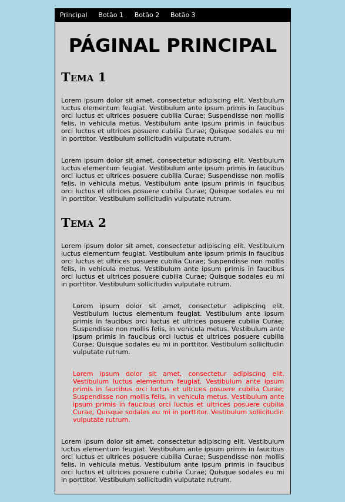

Tecnologia em Análise e Desenvolvimento de Sistemas

Setor de Educação Profissional e Tecnológica - SEPT

Universidade Federal do Paraná - UFPR

---

*TI161 - Desenvolvimento de Aplicações Web 1*

Prof. Alexander Robert Kutzke

**[Instruções para submissão de tarefas e trabalhos](http://gitlab.tadsufpr.net.br/ds120-alexkutzke/ds120-material-2017-2/blob/master/instrucoes_submissao_tarefas_e_trabalhos.md);**

# Atividade: CSS

Altere o arquivo `css/estilo.css` para que o arquivo `index.html` possua,
aproximadamente, a seguinte aparência:

